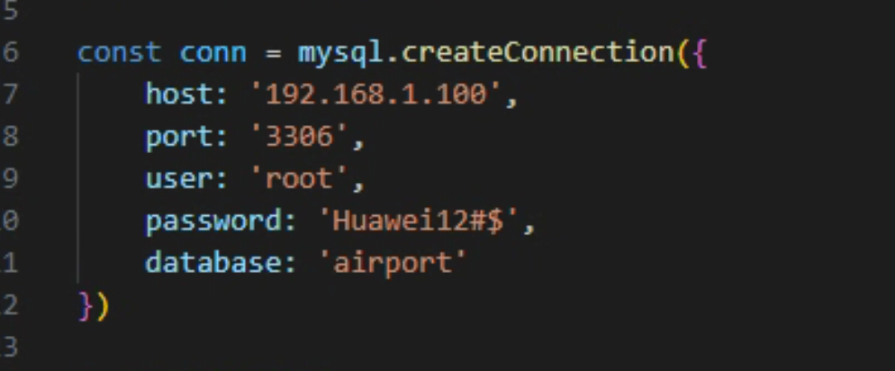
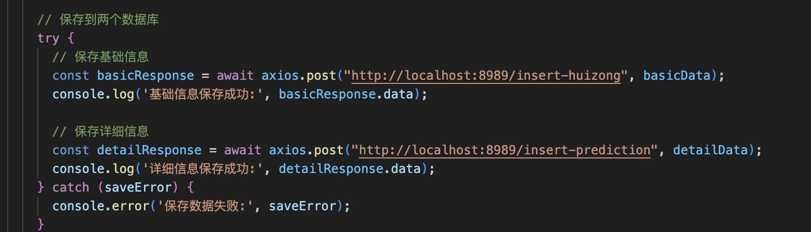
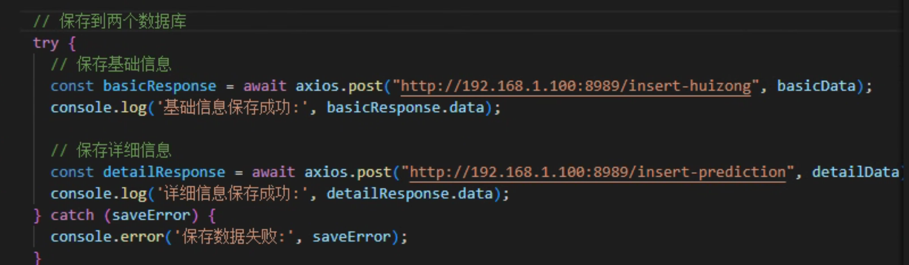
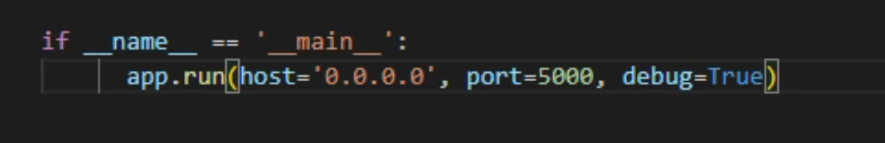
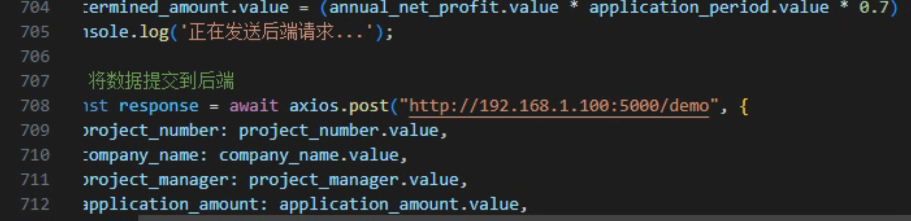
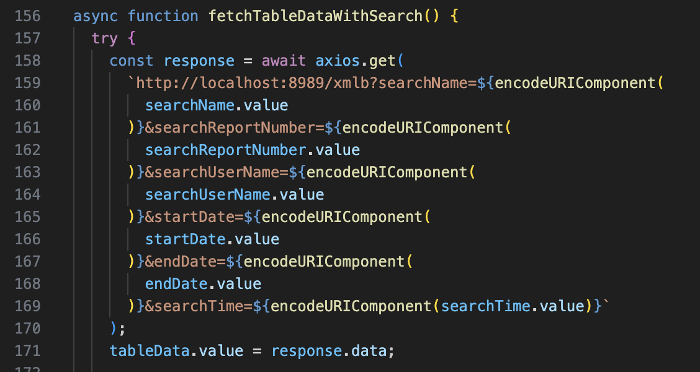
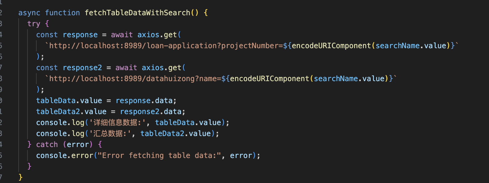

## 本地部署系统教程

#### 1.安装anaconda

#### 2. 安装pycharm

#### 3. 安装VS code

#### 4. 安装mysql+navicat

'''

https://blog.csdn.net/brrdg_sefg/article/details/146048667?ops_request_misc=%257B%2522request%255Fid%2522%253A%25226bf376d327e11ef5dfb358b95005a664%2522%252C%2522scm%2522%253A%252220140713.130102334..%2522%257D&request_id=6bf376d327e11ef5dfb358b95005a664&biz_id=0&utm_medium=distribute.pc_search_result.none-task-blog-2~all~sobaiduend~default-4-146048667-null-null.142^v102^pc_search_result_base2&utm_term=安装mysql和navicat&spm=1018.2226.3001.4187

''' 

#### 5. 安装 vue
 
#### 6. 修改index.js中的数据库链接，如果仅需要本地服务则只需要修改端口和密码，数据库名称。

#### 	如果希望局域网运行，则按照下列步骤修改：

#### 	1. 修改mysql的访问权限，改成支持全局IP访问。

#### 	2.修改index.js文件：将host修改成服务器的网址，如下 	3. 修改vis.vue文件：将post的地址从localhost改成服务器地址，如下

#### 	4. 修改后端app.py文件：改成可通过任意IP调用，如下

#### 	5. 修改Vis.vue文件：将数据提交到后端的post从127的地址改成服务器的地址，如下

*注意存入数据库的字段格式，尤其是文本要支持中文字符，utf-8

#### 6. 修改Admin.vue，将localhost改成服务器地址

#### 7. 修改zcpg.vue，将localhost改成服务器地址

